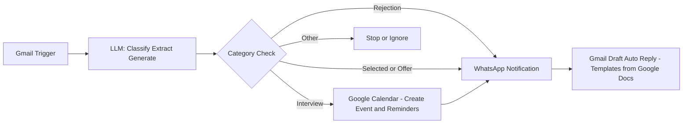

# 📩 Job Application Email Automation → WhatsApp + Calendar + AI Reply System

## 🚀 Overview

This project is an AI-powered automation system that intelligently processes job-related emails and takes real-time actions such as:

* 📲 Sending structured WhatsApp notifications
* 📅 Scheduling interviews in Google Calendar with reminders
* ✉️ Generating professional reply drafts using predefined templates (via Google Docs)

The system transforms passive email tracking into an **active, intelligent workflow**.

---

## 🧠 System Architecture

---

## 🔄 Workflow Explanation

### 🔹 1. Input Layer

* **Gmail Trigger**

  * Detects incoming emails
  * Filters job-related content

---

### 🔹 2. Processing Layer (LLM)

* **LLM (AI Engine)**

  * Classifies emails into:

    * Rejection
    * Interview
    * Selected
    * Offer
    * Other
  * Extracts:

    * Company name
    * Role
    * Interview date & time
    * Job description
  * Generates:

    * Structured WhatsApp message
    * Context-aware reply email

---

### 🔹 3. Decision Layer

* **Category Check**

  * Routes execution based on classification:

    * Interview → Calendar + Notification + Draft
    * Rejection → Notification + Draft
    * Selected/Offer → Notification + Draft
    * Other → Ignored

---

### 🔹 4. Action Layer

#### 📅 Google Calendar

* Creates interview events
* Adds reminders:

  * 1 day before
  * 1 hour before
  * 10 minutes before

---

#### 📲 WhatsApp Notification (via Twilio)

* Sends structured alerts including:

  * Company
  * Role
  * Status
  * Interview details

---

#### ✉️ Gmail Draft (Template-Based)

* Generates reply drafts automatically
* Uses **Google Docs as knowledge source** for templates
* Templates vary based on category:

  * Rejection → Gratitude + feedback request
  * Interview → Confirmation
  * Selected → Next steps interest
  * Offer → Acknowledgement

---

## 📲 Sample WhatsApp Output

📩 Job Update

🏢 Company: Infosys
💼 Role: Data Analyst
📌 Status: Interview

📅 Date: 10 May
⏰ Time: 11:00 AM

---

## ⚙️ Tech Stack

* Zapier — Workflow orchestration
* Gmail — Email trigger
* LLM (AI by Zapier) — Classification + generation
* Twilio — WhatsApp messaging
* Google Calendar — Scheduling & reminders
* Google Docs — Template storage

---

## ⚠️ Edge Case Handling

* Missing interview details → Skip calendar event
* Non-job emails → Filtered as "Other"
* Invalid AI output → Debug via Zapier task history

---

## 🧪 Testing Strategy

The system is validated using:

* Rejection emails
* Interview invitations
* Offer letters
* Ambiguous emails
* Non-relevant emails (filtered out)

---

## 🚀 Future Enhancements

* Extract meeting links (Google Meet / Zoom)
* Add job tracking dashboard (Google Sheets)
* Priority-based notifications (Interview/Offer only)
* Multi-channel alerts (Slack, Telegram)
* Resume-job matching analysis

---

## 💡 Use Cases

* Job seekers managing multiple applications
* Automation enthusiasts building AI workflows
* Portfolio projects demonstrating real-world AI + automation

---

## 🏁 Conclusion

This system showcases how AI + automation can:

* Reduce manual effort
* Improve response time
* Prevent missed opportunities

It is a practical implementation of an **event-driven, AI-powered workflow system**.

---
